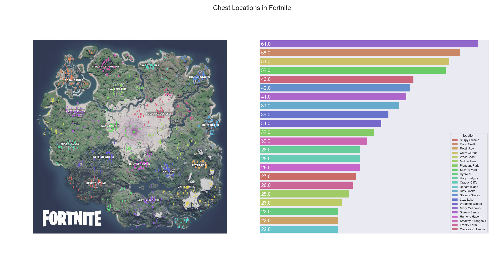

# Data Clustering and Visualization in Python with Fortnite

### Introduction
This repository has been made public to showcase an understanding of ETL and certain Python modules which are relevant to data analysis and engineering. Admittedly, I did not make use of SQL in this project, not because I couldn't, but because I deemed it unnecessary here. If we had large amounts of data being loaded at regular intervals, it would be logical and straightforward enough to set up, for example, a MySQL server and then automate that part of the process as well. There is plenty of information available online regarding this subject.

I set out to build a program that would take in a list of coordinates, group them together based on proximity, plot them on the Fortnite map, and sort them by count, descending. For context, players in the video game Fortnite must pick up weapons placed around the map and fight to be the last player standing. These items are often found in treasure chests, and each point plotted represents one chest. Players can start at any location, so the best strategy is generally to start where there are the most chests.

For those who just want to see the finished product, here it is:



### Setup and Parsing the Data
I got my data from [Fortnite.GG](https://fortnite.gg/) and saved it as plaintext. I could have set up automated web scraping with `requests` and `bs4` as I did in [JSAS](https://github.com/tzipor/jsas), but for a program to be run a single time for analysis of static data I feel that the plaintext option is simpler, easier, and faster. I saved the data, a list of coordinates, as [ChestCoordinates.txt](ChestCoordinates.txt).

First, here are our imports and constants:
```python
import ast
import pandas as pd
from sklearn.cluster import AgglomerativeClustering
import matplotlib.pyplot as plt
import seaborn as sns

CLUSTER_COUNT = 22
REAL_NAMES = ['Salty Towers', 'Coral Castle', 'Catty Corner',...]
```
We use `ast` to read our plaintext list as a list of lists instead of a list of strings. This way we can easily create a dataframe later. The remaining imports should be recognized as par for the course in data science. As for the constants, `CLUSTER_COUNT` is self-explanatory and `REAL_NAMES` matches a name to each cluster for the purpose of presentation.

Now let's parse the text and create our dataframe:
```python
z = []
with open('ChestCoordinates.txt', 'r') as txtfile:
    data = txtfile.read()
    data = data.replace('],[', ']x[')
    data = data.split('x')

    for thing in data:
        z.append(ast.literal_eval(thing))

for thing in z:
    thing[0], thing[1] = thing[1], thing[0]

df = pd.DataFrame(z, columns=['x_coord', 'y_coord'])
```
Since we are dealing with a list of lists, I replaced every "outer" comma with an `x` and split the overall string into items based on that. Then each item is added to the previously empty list `z` which is then used to create a `pandas` dataframe. Notably, the coordinates as obtained are reversed, so we switch them here as well.

### Clustering
To categorize each treasure chest by location we'll use agglomarative clustering, a form of unsupervised learning in which points are categorized based on the distance between them and the points around them. This involves many calculations that could, given enough time, be done by hand, but as is often the case there is a Python module that can do it in two lines:
```python
cluster = AgglomerativeClustering(n_clusters=CLUSTER_COUNT, affinity='euclidean', linkage='ward')
labels = cluster.fit_predict(df)
```
At this point we can map the real location names to the numerical clusters. Without writing many more lines of code, the simplest way is to plot the numbered clusters and use trial and error to put the list items in `REAL_NAMES` in the appropriate order. When this is done, we can add the locations as a new column in the dataframe.
```python
named_labels = []
for coord in labels:
    named_labels.append(REAL_NAMES[coord])
df['location'] = pd.Series(named_labels, index = df.index)
```

### Plotting
Since we're working with Python, I used MatPlotLib and Seaborn to visualize the data. Since I wanted to show a scatterplot and the amount of chests in each cluster, I created two subplots on which to place both of these and adjusted `figsize` until I felt it looked right. Before actually plotting the data, I also lowered the saturation of the map image I found in Photoshop. This was done in order to make the plotted data more easily discernable.

With that out of the way, I created both a scatterplot and a countplot side by side using Seaborn:
```python
sns.set()
fig, axes = plt.subplots(1, 2, figsize=(6,6))
img = plt.imread('Fortnite-Chapter-2-Season-5-Map.jpg')

scatter = sns.scatterplot(ax=axes[0],
                          data = df,
                          x = 'x_coord',
                          y = 'y_coord',
                          edgecolor = 'none',
                          hue = 'location',
                          palette=sns.color_palette('hls', n_colors = CLUSTER_COUNT),
                          marker = 'd',
                          legend = False)
scatter.grid(False)
scatter.imshow(img, extent = [0,256,-256,0], zorder = 0)
scatter.set_ylabel('')
scatter.set_xlabel('')
scatter.set(xticklabels=[])
scatter.set(yticklabels=[])

bar = sns.countplot(ax=axes[1],
                    data = df,
                    y = df['location'],
                    palette = sns.color_palette('hls', n_colors = CLUSTER_COUNT),
                    edgecolor = 'none',
                    order = df['location'].value_counts().index,
                    hue = df['location'],
                    dodge = False)
bar.grid(False)
bar.set(xlabel='', ylabel='')
bar.set(xticklabels=[])
bar.set(yticklabels=[])
for p in bar.patches:
    bar.annotate(p.get_width(),
                 xy=(p.get_width()-p.get_width() + 0.05,
                     p.get_y()+p.get_height()/2 + 0.05),
                 xytext=(5, 0),
                 fontsize=18,
                 textcoords='offset points',
                 ha="left",
                 va="center",
                 color = 'white')
```
It is my opinion that most of this lengthy code snippet is self-explanatory, however I will touch on a few points:
- The negative bounds on the Fortnite map image behind the scatterplot may not seem to make sense. Looking at `ChestCoordinates.txt` we can see that each point is plotted on a 256x256 grid with negative y-coordinates, so the simplest way to use this data was to modify the bounds instead of adding another step to the parsing process.
- Adding the `hue` variable to the countplot immediately makes each bar very thin. After some research, I came across a closed issue on the Seaborn GitHub page regarding this matter which provided an easy solution. The `hue` variable adds an additional level of nesting which necessitates we also add `dodge = False`.
- I chose to use the HLS option for `sns.color_palette` in order to maximize contrast between the clusters. While it may be difficult for some to distinguish between similarly colored clusters as is, I found every other option to be far worse. Using the same colors for both the scatterplot and the countplot helps to identify a given cluster.

### Wrapping Up
After adjusting formatting of the overall figure, the code is finished and we show the figure:
```python
plt.subplots_adjust(wspace = 0)
fig.tight_layout()
fig.suptitle('Chest Locations in Fortnite', size = 24)
plt.subplots_adjust(top=0.85)
plt.show()
```

Now that we are done, Misty Meadows is the clear winner by chest count with 61 chests. There are also excellent options for movement to the north in Hunter's Haven and Lazy Lake, so it seems like Misty Meadows is the best starting location. Indeed, real gameplay verifies the wealth of items available here as well as the natural path north toward the center of the map as described.
